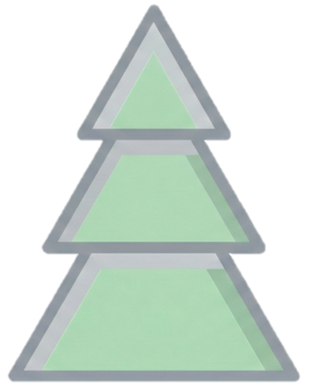

#  CEDAR Benchmark
<a href='https://arxiv.org/pdf/2601.13024'></a><a href="./LICENSE"></a>

Paper: [Tears or Cheers? Benchmarking LLMs via Culturally Elicited Distinct Affective Responses](https://arxiv.org/pdf/2601.13024)

We present some representative examples from CEDAR.
Codes and full Datasets will be released soon!

## Citation

If this work is helpful, please kindly cite as:

```bibtex
@article{dai2026tears,
  title={Tears or Cheers? Benchmarking LLMs via Culturally Elicited Distinct Affective Responses},
  author={Dai, Chongyuan and Shen, Yaling and Hu, Jinpeng and Gao, Zihan and Li, Jia and Jiang, Yishun and Wang, Yaxiong and Liu, Liu and Ge, Zongyuan},
  journal={arXiv preprint arXiv:2601.13024},
  year={2026}
}
```
